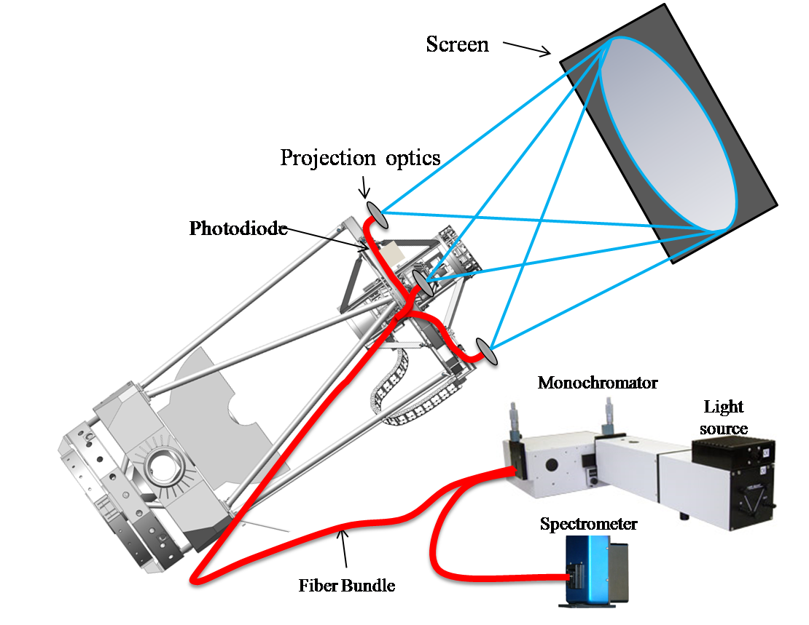

Daniel Freeman

A standard system for telescope transmission observing and calibration (Astrocal) is a spectrophotometric calibration system used on 0.4 meter to 4 meter telescopes in the 300nm to 1100nm range.

Astrocal is intended to be used on all telescopes used for a follow up on the data Large Synoptic Sky Survey Telescope (LSST) will be gathering. If multiple telescope are used for this they must be calibrated to a common photometry scale, so they can be compared to the data produced by a single telescope.

Astrocal works fundamentally the same as DECal. Like DECal, Astrocal consists of seven major components: a light source; monochromator; spectrometer; fiber bundle; projectors; photodiodes; and a lambertian screen, Figure 1.

<figure>
  
  <figcaption>Figure 1: a systems diagram of DECal[1] and Astrocal. The light source provides light to the monochromator. The monochromater mechanically selects a specific wavelength of light. The light is carried by the fiber optic cable, and evenly projected through engineered diffusers onto a lambertian screen. Photodiodes mounted around the top of the telescope see the light being bounced off the lambertian screen. The amount of light seen by the photodiodes is compared to the amount of light seen by the CCD in the telescope. The relative throughput of the telescope can be determined from this.</figcaption>
</figure>

## Research
The biggest challenge with making DECal mobile, stems from the wide variety of telescopes it would be calibrating. To get an idea of what Astrocal would face in the real world, a list of 22 telescopes to research was made. These telescopes were chosen because they are candidates for calibration once Astrocal is complete. Research on these telescopes focused on aspects of their design that would influence Astrocal's mounting system, and projection pattern. These criteria include: Primary mirror diameter; secondary mirror diameter; f/#; dome clearance; and if the telescope is made out of a material that a magnetic mount could attach to, like steel, Figure 2.

<figure>
  
  <figcaption>Figure 2: Telescopes Researched</figcaption>
</figure>

In addition to the research on telescopes, research was conducted on improving the individual components of DECal, and reusing components from precal. The most important of these was the light source. DECal's light source used two separate lamps, this was done because neither could cover the 300nm to 1100nm range. The 75 watt was used from 300nm to 700nm, and the quartz was used from 700nm to 1100nm. The new light source, an EQ-99X[2], can cover the whole range and it is brighter than the previous light sources. This increase in brightness is important because it allows us to take shorter exposer times, due to the photodiodes and the telescope seeing more light in a given timeframe. This will shorten the overall length of time needed to perform a calibration.

The main component that will be adapted from precal is the monochromator. The monochromator used on precal is a version that can only have one light source mounted to it at a time. While this would be a problem for DECal, Astrocal only uses one light source so this isn't a problem.

## Dome clearance
One of the design parameters for Astrocal is the distance between the top of a telescope to the dome wall Figures 2 and 3. This is important because the engineered diffusers need distance to spread to their target diameter. If there was just one projector the target diameter would be the diameter of the lambertian screen. The labertian screen is the same diameter as the primary mirror. The dome clearance was determined by looking at pictures of the telescopes and comparing the diameter of the telescope to the distance between the front of the telescope and the dome. This method, while relatively inaccurate, allowed us to find outliers.

In order to evenly project light onto the lambertian screen diffusers have to be used. Diffusers take light and project it in a cone at a set angle. The diffusers we chose are polymer on glass engineered diffusers from RPC Photonics[3]. Diffusers come in angles ranging from half a degree to 120 degrees. It was determined that diffusers with different angles could be used to alter the necessary dome clearance for a given telescope. The number of projectors used can also alter the clearance needed. More projectors require less clearance because they don't need to spread out to as large of a diameter. Figure 3 shows the patterns for different numbers of projectors.
