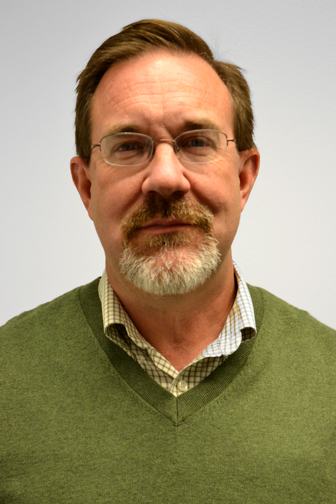
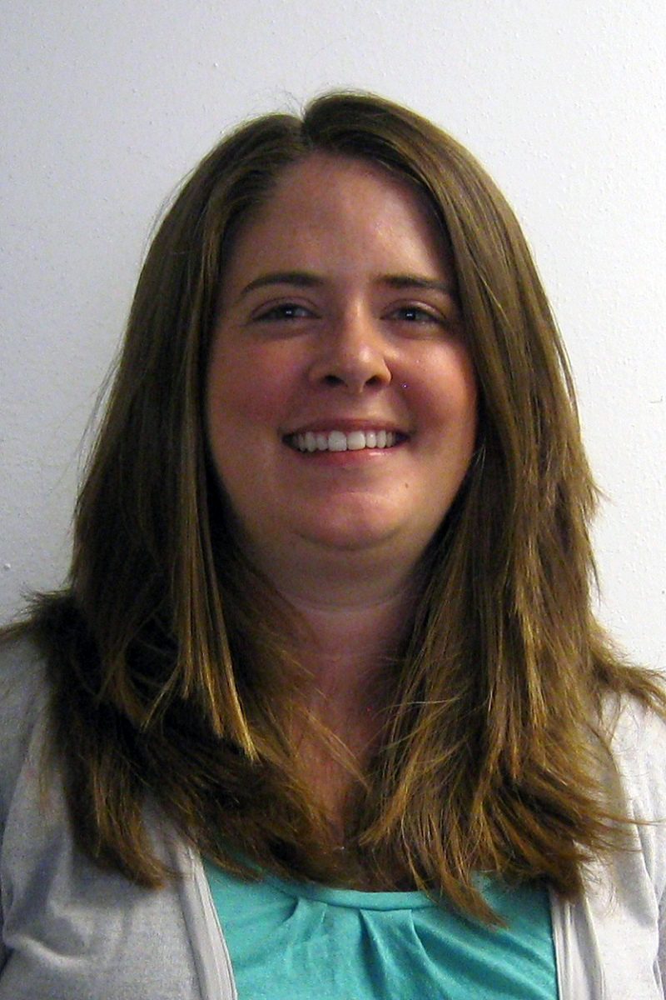
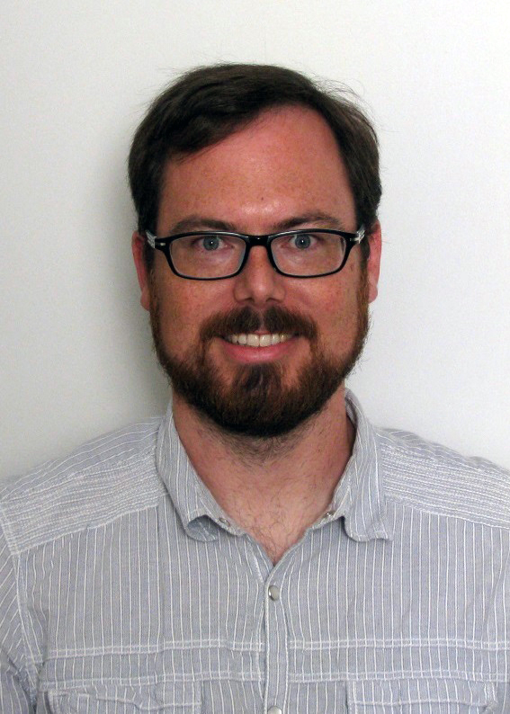
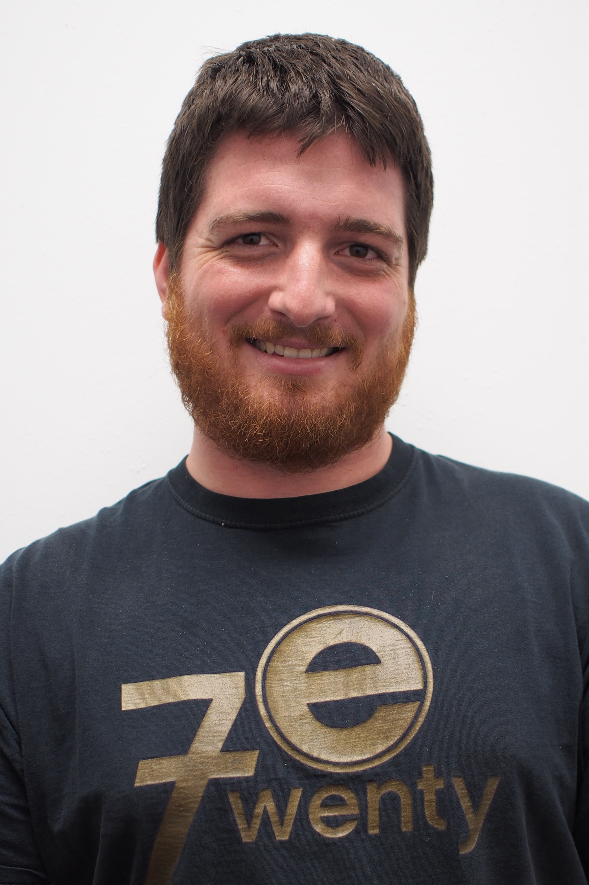
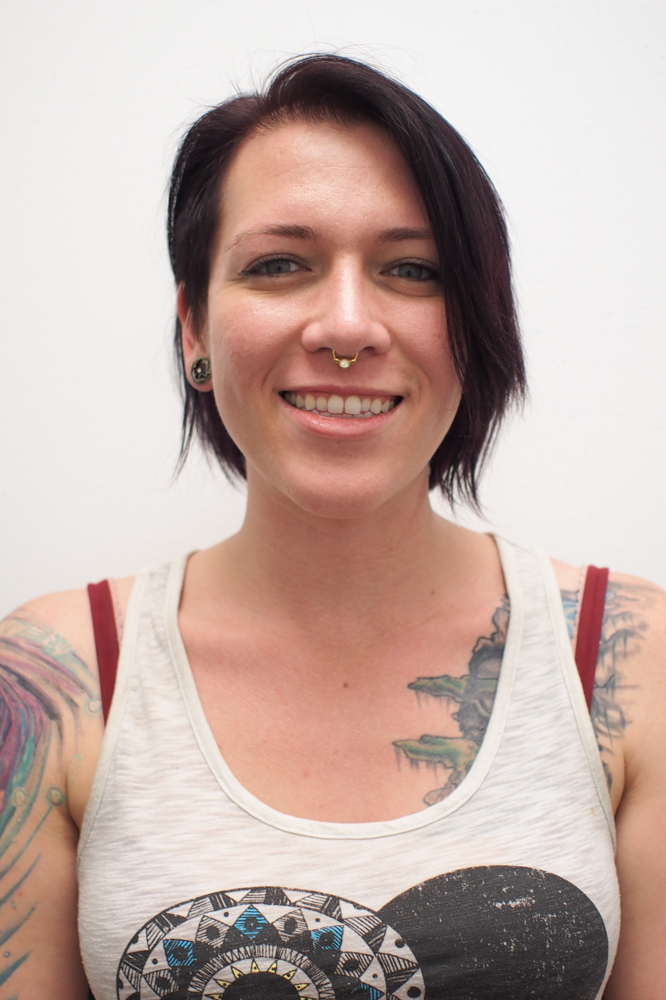
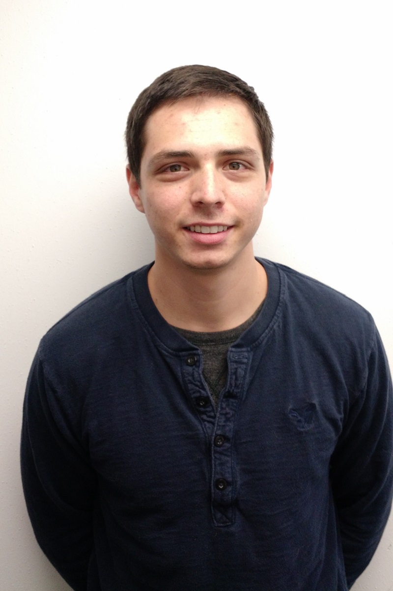
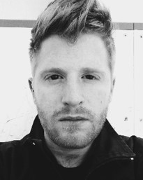

## Darren DePoy
 [Darren DePoy](http://physics.tamu.edu/people/depoy) is the Rachal/Mitchell/Heep endowed professor of Physics and Astronomy and is the head of the Astronomical Instrumentation Lab. He came to Texas A&M in 2008 after working at The Ohio State University for 18 years, where he was the Vice-Chair for Instrumentation. Dr. DePoy has designed and built state-of-the-art optical and infrared astronomical instruments for telescopes all over the world, including OSIRIS currently on the SOAR telescope in Chile, TIFKAM at the MDM Observatory in Arizona, ANDICam at the Cerro-Tololo Interamerican Observatory (CTIO) in Chile, DANDICam at South African Astronomical Observatory, MODS on the LBT telescope in Arizona, a new instrument called [DECam](http://instrumentation.tamu.edu/DeCal.html) for the CTIO 4-meter telescope, and [VIRUS](http://instrumentation.tamu.edu/virus.html), the instrument that supports the Hobby-Eberly Telescope Dark Energy Experiment.
## Jennifer Marshall
 [Jennifer Marshall](http://physics.tamu.edu/people/jlm076) manages the day-to-day operations of the Astronomical Instrumentation Lab. Professor Marshall's background is in instrumentation, having earned a Ph.D. in instrumentation and observational astronomy in 2006. She is the lead for Texas A&M’s involvement in the VIRUS project, is a co-PI on the Giant Magellan Telescope Wide-Field Optical Spectrograph ([GMACS](/instruments/gmacs/)), and is generally involved in all other ongoing activities in the lab.

## Travis Prochaska
 [Travis Prochaska](http://physics.tamu.edu/people/tprochaska/) is the Senior Mechanical Engineer Specialist in the Astronomy Instrumentation Lab at Texas A&M University. Since the beginning of 2010 he has worked on the vast majority of the mechanical and opto-mechanical needs of the lab. This includes designing, building and verifying systems for telescopes, spectrographs and calibration systems for the HET Dark Energy Experiment ([HETDEX](http://instrumentation.tamu.edu/instruments/hetdex/)), Dark Energy Camera ([DECam](http://instrumentation.tamu.edu/instruments/decal/)), Giant Magellan Telescope ([GMT](http://instrumentation.tamu.edu/instruments/gmt/)) projects along with various smaller projects. Travis also manages several students each semester, who assist him many assembly, fabrication and design tasks. He currently works on the new [GMACS](http://instrumentation.tamu.edu/instruments/gmacs/) spectrograph conceptual design, a proposed instrument for the Giant Magellan Telescope. On this project, he oversees the design of the structure, mechanisms and optics housings.
## Luke Schmidt
 [Luke Schmidt](https://physics.tamu.edu/people/lschmidt/) is an Assistant Research Scientist in the Astronomical Instrumentation Lab where he works on a variety of projects, including development of [GMACS](http://instrumentation.tamu.edu/instruments/gmacs/), the Giant Magellan Telescope Wide-Field Optical Spectrograph. Dr. Schmidt has been involved with the development of several other optical and infrared astronomical instruments including AMASING (Aperture Masking And Speckle ImagiNG), NESSI (New Mexico Exoplanet Spectroscopic Survey Instrument) both at the Magdalena Ridge Observatory 2.4m Telescope. Before coming to Texas A&M he was an Instrumentation Scientist with the Magdalena Ridge Observatory Interferometer project. There he helped develop ICoNN, the Infrared Coherencing Nearest Neighbor fringe tracker as well as several other subsystems related to beam transport and automated alignment.
## Erika Cook
 Erika Cook is an Electrical Engineer at the Astronomical Instrumentation Lab working on the software and controls for [GMACS](http://instrumentation.tamu.edu/instruments/gmacs/) and the [Boller & Chivens 16 inch telescope mount.](http://instrumentation.tamu.edu/instruments/bctelescope/) Her past projects include prototyping and testing the cooling system for the [VIRUS enclosures](http://instrumentation.tamu.edu/instruments/virusenclosures/), and writing control software for the [BINOSPEC](http://instrumentation.tamu.edu/instruments/binospec/) calibration screen.

## Mary Anne Limbach

Mary Anne Limbach is an Optical Engineer in the Astronomical Instrumentation Lab where she working on [GMACS](http://instrumentation.tamu.edu/instruments/gmacs/) Mrs. Limbach has worked in the instrumentation field for nearly a dozen years and has been lead optical engineer on several instruments including and exoplanet direct-imaging integral field spectrograph (CHARIS) for the Subaru telescope built at Princeton University and an instrument designed to test coronagraphs (BESSEL) at the University for Arizona.

## Peter Ferguson
 Peter Ferguson is a graduate student. Interested in instrumentation, statistics, and observational astronomy. Currently working on characterizing the near infrared sky emission at Gemini Observatory using F2 particularly in the k-band.

## Sarah Cantu
 Sarah Cantu is a graduate student interested in working with instrumentation as a way to better understand the science done in astronomy. Her science interests include galactic astronomy with a focus on the structural parameters of dwarf galaxies.

## Who else goes here?

## Undergraduates
 Marcus Sauseda is an undergraduate Aerospace Engineering major who designs project protypes and mechanical assemblies using CAD solid modeling. He also maintains the mechanical lab, electronics lab, and machining lab and advises the mechanical designs for the [REU projects.](http://instrumentation.tamu.edu/REU2016/)

 [Nate Peirson](http://npeirson.github.io/) is an undergraduate who tickles the keyboard while on an intravenous caffeine drip. He maintains the lab website, gives great high-fives, and hopes one day to do something with turquoise. He also serves as the President of the Students for Exploration and Development of Space ([SEDS](http://seds.org)) Texas A&M University Chapter.

## Previous Team Members
[Click here](http://instrumentation.tamu.edu/people/previous/) for a list of previous team members. *Please note that some information may be outdated.*
