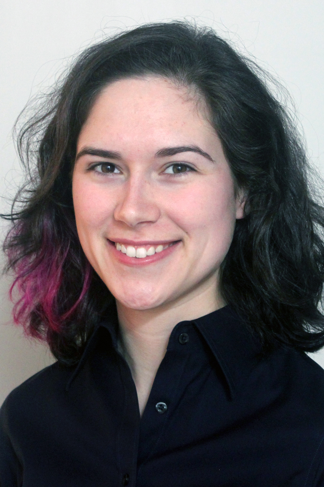
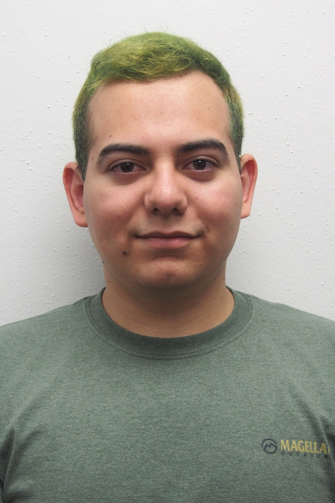
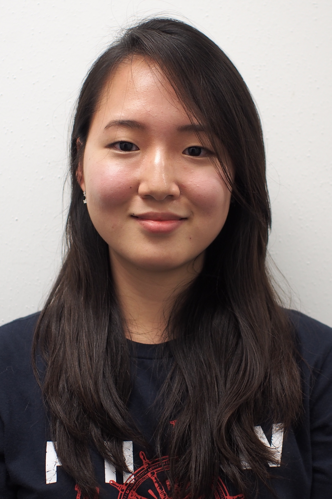

## Darren DePoy
 [Darren DePoy](http://physics.tamu.edu/people/depoy) is the Rachal/Mitchell/Heep endowed professor of Physics and Astronomy and is the head of the Astronomical Instrumentation Lab. He came to Texas A&M in 2008 after working at The Ohio State University for 18 years, where he was the Vice-Chair for Instrumentation. Dr. DePoy has designed and built state-of-the-art optical and infrared astronomical instruments for telescopes all over the world, including OSIRIS currently on the SOAR telescope in Chile, TIFKAM at the MDM Observatory in Arizona, ANDICam at the Cerro-Tololo Interamerican Observatory (CTIO) in Chile, DANDICam at South African Astronomical Observatory, MODS on the LBT telescope in Arizona, a new instrument called [DECam](/instruments/decal) for the CTIO 4-meter telescope, and [VIRUS](http://hetdex.org/hetdex/virus.html), the instrument that supports the Hobby-Eberly Telescope Dark Energy Experiment.
## Jennifer Marshall
 [Jennifer Marshall](http://physics.tamu.edu/people/jlm076) manages the day-to-day operations of the Astronomical Instrumentation Lab. Professor Marshall's background is in instrumentation, having earned a Ph.D. in instrumentation and observational astronomy in 2006. She is the lead for Texas A&M’s involvement in the [VIRUS](http://hetdex.org/hetdex/virus.html) project, is a co-PI on the Giant Magellan Telescope Wide-Field Optical Spectrograph ([GMACS](/instruments/gmacs/)), and is generally involved in all other ongoing activities in the lab.

## Luke Schmidt
 [Luke Schmidt](https://physics.tamu.edu/people/lschmidt/) is an Assistant Research Scientist in the Astronomical Instrumentation Lab where he works on a variety of projects, including development of [GMACS](/instruments/gmacs/), the Giant Magellan Telescope Wide-Field Optical Spectrograph. Dr. Schmidt has been involved with the development of several other optical and infrared astronomical instruments including AMASING (Aperture Masking And Speckle ImagiNG), NESSI (New Mexico Exoplanet Spectroscopic Survey Instrument) both at the Magdalena Ridge Observatory 2.4m Telescope. Before coming to Texas A&M he was an Instrumentation Scientist with the Magdalena Ridge Observatory Interferometer project. There he helped develop ICoNN, the Infrared Coherencing Nearest Neighbor fringe tracker as well as several other subsystems related to beam transport and automated alignment.
## Erika Cook
 Erika Cook is an Electrical Engineer at the Astronomical Instrumentation Lab working on the software and controls for [GMACS](/instruments/gmacs/) and the [Boller & Chivens 16 inch telescope mount.](http://instrumentation.tamu.edu/instruments/bctelescope/) Her past projects include prototyping and testing the cooling system for the [VIRUS enclosures](/instruments/hetdex/#virus-enclosures), and writing control software for the [BINOSPEC](/instruments/binospec/) calibration screen.

## Mary Anne Limbach

Mary Anne Limbach is an Optical Engineer in the Astronomical Instrumentation Lab where she working on [GMACS](/instruments/gmacs/) Mrs. Limbach has worked in the instrumentation field for nearly a dozen years and has been lead optical engineer on several instruments including and exoplanet direct-imaging integral field spectrograph (CHARIS) for the Subaru telescope built at Princeton University and an instrument designed to test coronagraphs (BESSEL) at the University for Arizona.

## Lauren Aldoroty
Lauren Aldoroty is a graduate student in the Department of Physics and Astronomy. She is interested in spectroscopy and applications of 3D printing to astronomical instrumentation. Lauren is currently investigating the feasibility of using commercially available 3D printing materials for slit mask manufacturing.

## Peter Ferguson
Peter Ferguson is a graduate student. Interested in instrumentation, statistics, and observational astronomy. Currently working on characterizing the near infrared sky emission at Gemini Observatory using F2 particularly in the k-band.

## Leonardo Barba
Leonardo Barba is an undergraduate Physics major who has been working on hardware and software for TCal and ETSI while also helping put together ETSI. He also helps with general lab necessities and monthly Star Parties.

## Doyeon Kim
Doyeon Kim is an undergraduate Applied Mathematics major who works on <a href="/instruments/reflectance/" target="_blank">Total Reflectance Measurements</a> on various black materials. She also helps maintain the Texas A&M Astronomical Instrumentation Lab website and organize the monthly <a href="/pages/starparty/" target="_blank">Star Parties.</a>

## Cole Mason

Cole Mason is an undergraduate Physics major. He helps with the GMT and GMACS. He plans to minor in Astronomy and Mathematics.

## Evan Kelly
Evan Kelly is an Aerospace Engineering Major and is minoring in mathematics. Through the use of advanced analytical calculations and streamlined modeling, Evan is paving a new path in the field of Astronomy. Time in the lab is spent developing a prototype scale model of the GMACS.

## Cynthia Froning

Cynthia Froning is a visiting scholar.

 
## Previous Team Members
[Click here](./previous/) for a list of previous team members. *Please note that some information may be outdated.*